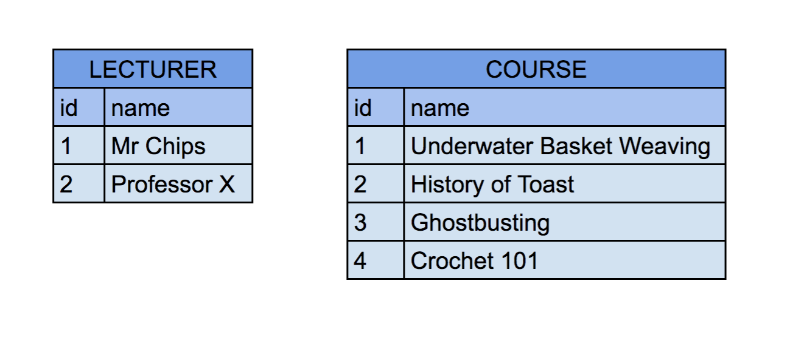

# Table Relationships

## Learning objectives

1. Describe the structure of a one-to-many and a many-to-many relationship.
2. Understand how one-to-many and many-to-many relationships are represented at a database level.
3. Create databases tables representing one-to-many and many-to-many relationships.

## Intro

A significant part of good relational database design is understanding how to divide data into related tables.  If you're designing a system for an online store, you're likely to need to retain information on both users and orders.  This information shouldn't be stored in the same table but it **is** related - information relating to an order is unlikely to be particularly useful if we have no way of knowing who placed it.  We can store these links by using table relationships.

There are three types of relationships which can exist between tables in a relational database - one-to-one, one-to-many, and many-to-many.  Looking at the latter two, we'll try to answer four useful questions.

a) What is the structure of the relationship?
b) How is the relationship represented in a database?
c) How is the relationship established using SQL?
d) How do we make use of the relationship to query data?

## One-to-many
#### What is the structure of the relationship?

A one-to-many relationship describes a situation in which one parent model _**has many**_ children, while the child model can be said to _**belong to**_ one parent.

More concretely, let's imagine we're designing a database system for a university which, for now, has two tables - one for lecturers, and one for courses.



Presumably it's the case that each lecturer is responsible for teaching more than one course - i.e. a lecturer
_**has many**_ courses.

We can also assume that each course is taught by a particular lecturer - i.e. a course _**belongs to**_ a particular lecturer.

#### How is the relationship represented in a database?

Representing a one-to-many relationship is straightforward - we add a column to the child model's table referencing the id of the parent model.

LECTURER                          COURSE
-------------------               -----------------------------------------------
|id  |name        |               |id |title                       |lecturer_id |
-------------------               ----------------------------------------------|
|1   |Mr Chips    |               |1  |Underwater Basket Weaving   |2           |
|2   |Professor X |               |2  |History of Toast            |1           |
-------------------               |3  |Ghostbusting                |1           |
                                  |4  |Crochet 101         |2           |
                                  ----------------------------------------------|

We can now see that Mr Chips teaches courses on the History of Toast and Ghostbusting, while Professor X is responsible for Underwater Basket Weaving and Crochet 101.

The data in this new column is referred to as a _**foreign key**_.

#### How is the relationship established using SQL?

```sql
CREATE TABLE course (id SERIAL PRIMARY KEY, title VARCHAR(60), lecturer_id integer REFERENCES lecturer(id))
```

#### How do we make use of the relationship to query data?

Lets imagine we want to retrieve a list of all courses taught by Professor X from our database.  We can see that his id is 2, so we can do the following:

```sql
SELECT * FROM course WHERE lecturer_id = 2;
```

This will return us a list of all rows from the course table where the value in the lecturer_id column is 2.

## Exercise 1

* Create a database with the name toy_db
* Create two tables - users, and posts
* Users should have an id, name, and a password
* Posts should have and id and content
* Your tables should reflect a one-to-many relationship where users can _**have many**_ posts

## Many to Many
#### What is the structure of the relationship?

A many-to-many relationship describes a relationship between two models where there is no parent/child hierarchy - both models can be associated with _**multiple instances of the other**_.

For example, let's imaging that we now want to add a third table to our university database, this time listing students.

LECTURER                          COURSE                                            STUDENT
-------------------               -----------------------------------------------   -----------------
|id  |name        |               |id |title                       |lecturer_id |   |id |name       |
-------------------               ----------------------------------------------|   -----------------
|1   |Mr Chips    |               |1  |Underwater Basket Weaving   |2           |   |1  |Bert       |
|2   |Professor X |               |2  |History of Toast            |1           |   |2  |Ernie      |
-------------------               |3  |Ghostbusting                |1           |   |3  |Elmo       |
                                  |4  |Crochet 101         |2           |   -----------------
                                  ----------------------------------------------|

Again, there seems to be a possible relationship here - a student can enrol in many courses, while each course can have many students enrolled in it.  In other words a student _**has many**_ courses and a course _**has many**_ students.

#### How is the relationship represented in a database?

There are a number of ways we could theoretically represent this relationship;

One option would be to add a course_id column to the students table and populate it with a list of course ids.

STUDENT
----------------------------
|id |name       |class_ids |
----------------------------
|1  |Bert       |1,3,4     |
|2  |Ernie      |2,4,      |
|3  |Elmo       |1,2,3     |
----------------------------

This, however, could quickly become difficult to maintain and query.  Another option would be to add multiple columns to the student table referencing each course they are enrolled in.

STUDENT
-----------------------------------------------------
|id |name       |class_1_id |class_2_id |class_3_id |
-----------------------------------------------------
|1  |Bert       |1          |3          |4          |
|2  |Ernie      |2          |4          |           |
|3  |Elmo       |1          |2          |3          |
-----------------------------------------------------

The limitations of this approach should be fairly obvious.

The best method of representing a many-to-many relationship available to us is to create a *join table*.

COURSE                                            STUDENT             STUDENT_COURSE
-----------------------------------------------   -----------------   -----------------------------
|id |title                       |lecturer_id |   |id |name       |   |id |student_id | course_id |
----------------------------------------------|   -----------------   -----------------------------
|1  |Underwater Basket Weaving   |2           |   |1  |Bert       |   |1  |1          |1          |
|2  |History of Toast            |1           |   |2  |Ernie      |   |2  |1          |3          |
|3  |Ghostbusting                |1           |   |3  |Elmo       |   |3  |1          |4          |
|4  |Crochet 101         |2           |   -----------------   |4  |2          |2          |
----------------------------------------------|                       |5  |2          |4          |
                                                                      |6  |3          |1          |
                                                                      |7  |3          |2          |
                                                                      |8  |3          |3          |
                                                                      -----------------------------

#### How is the relationship established using SQL?

```sql
CREATE TABLE student_course(id SERIAL PRIMARY KEY, student_id integer REFERENCES student(id), class_id integer REFERENCES class(id));
```

#### How do we make use of the relationship to query data?

Querying this data is a little more involved than a one-to-many relationship.  Let's imagine we want to get a list of all classes being taken by the student with the id of 2.  This means we need to:
- retrieve the course id and name columns from the course table...
- for every row from the student_course table...
- where the data in the student_id column is a 2.

```sql
SELECT course.id, course.name FROM
student_course INNER JOIN course ON course.id = student_course.course_id
WHERE student_course.course_id = 1;
```

Let's break this statement down a little.

- the SELECT clause on the first line determines the columns we want to see in our output.  In this case the id and name columns from the course table.
- The INNTER JOIN clause on line two essentially says; 'merge the rows from these two tables'.  In this example, take the id and name columns from the course table, and add them onto the student_course table, creating a new, temporary table in the process.
- the WHERE clause on the third line acts as a filter on which rows from this new table are returned.  In this case it says 'only show me the rows where the course_id data is equal to 2'.

## Exercise 2
* Create a new table in toy_db - tags
* Tags should have and id and content
* Your tables should reflect a many-to-many relationship between Tags and Posts.

##Extension
Using either the command line or TablePlus, add some data into your tables.  Use the relationships you have modelled to try querying the data.
